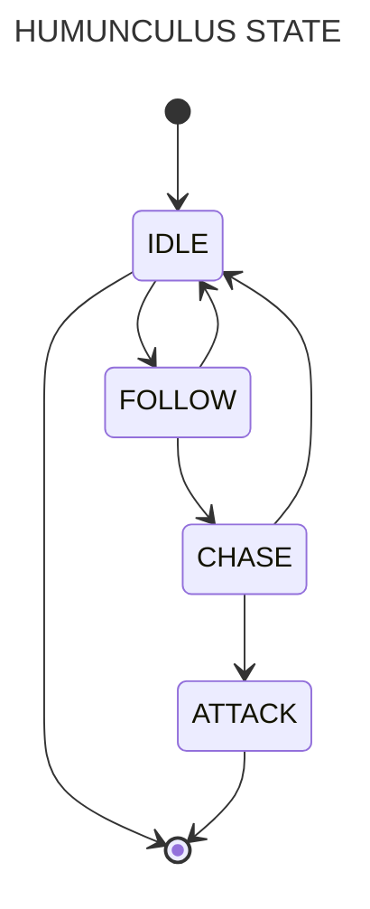

# Homunculus AI Script User’s Guide

> docs updated by [Max Del Canto](https://github.com/maxmx03) - seg 18 mar 2024

A documentação abaixo foi feita pela gravity, apenas fiz pequenas alterações. \
Caso queira aprender Lua visite meu site: [Max's site](https://maxmx03.github.io/site/Lua%20Guide/Getting%20Started/).

## Introduction

We developed the Homunculus AI System to enable RO gamers to customize
Homunculus behaviors by creating their own, unique AI files that they can
share with the RO community.  Homunculus AI scripts are written in the LUA
programming language and processed by a program embedded in the RO client.
For more information on the LUA language,
please visit [http://www.lua.org](http://www.lua.org/),
Homunculus action is controlled by the AI.lua and Util.lua files inside the
AI folder in the Ragnarok Client program folder.  We plan to add more functions
to the Homunculus AI scripts to enhance Homunculus behavior customization.
For users who are unfamiliar with scripting or computer programming, we will
provide official AI scripts that all players can employ as a reference.

## Script Performance Properties

Three files located in the AI folder in the Ragnarok Online client program
directory (`C:\\Program Files\\Gravity\\Ragnarok Online\\AI` by default) are
central to the Homunculus AI script performance: AI.lua, Const.lua and Util.lua.

### AI.lua

AI.lua contains the AI(id) functions that dictate a Homunculus’s action.
You can modify your Homunculus’s behavior by editing the contents of this file.
The RO client requires a working AI.lua file for Homunculus operation and if
the RO client finds any grammatical or logical errors in this file, a message
noting the location of the error will be displayed and the program will halt.

### Const.lua

This file contains constant variables used in Homunculus scripting and operation,
and it refers to both AI.lua and Util.lua. 
The RO client doesn’t require this file for Homunculus operation,
but const.lua is necessary for enabling Homunculus behaviors of greater complexity.

### Util.lua

This file contains the data structure for the Homunculus AI, which we will
call a List, and a few basic computation functions. 
The RO client doesn’t require this file for Homunculus operation,
but Util.lua is necessary to enable the Homunculus AI to queue commands and to
store lists of information for Homunculus operation, such as specific enemy
monsters or characters.
Each time before a Homunculus spawns, the RO client automatically processes the
AI.lua and Util.lua files.  If there are any errors in AI.lua or Util.lua files,
the RO client will halt and display an error message detailing the location of
the error.  Otherwise, the RO client will execute the AI(id) functions that
are scripted in the AI.lua file, activating the Homunculus AI. 
A Homunculus spawns when the following situations occur.

1. Creating a Homunculus
2. Reviving a dead Homunculus
3. Starting the game with a character that possesses a Homunculus
4. Using Fly Wing or Butterfly Wing with a character that possesses a Homunculus
5. Using a Warp Portal with a character that possesses a Homunculus
6. Using the Kafra Teleport Service with a character that possesses a Homunculus
7. Ragnarok Client Built-In Functions

The AI(id) functions are already built into the RO client and include
fundamental actions such as movement, attacking, eating and skill usage. 
These functions use id numbers to identify in-game objects such as specific
Homunculi, monsters or characters.  The following is a reference list of basic
functions that Homunculi can perform.

### MoveToOwner (id)

- **id**: Homunculus ID
- **Return value**: None

Homunculus moves to the spot closest to its owner.

### Move(id, x, y)

- **id**: Homunculus ID
- **x**: x-axis coordinates on current map
- **y**: y-axis coordinates on current map
- **Return value**: None

Homunculus moves to a specific destination on the current map.

### Attack(id1, id2)

- **id1**: Homunculus ID (Attacker)
- **id2**: Target ID
- **Return value**: None

Commands Homunculus (id1) to attack a target (id2).

### GetV(V\_, id)

- **V\_...**: A constant variable that displays the property of the targeted object
- **id**: Target object
- **Return value**: The constant variable used in this function determines
  which return value is used. The return value for V_POSITION is x,y coordinates,
  and the return value for V_HP is an HP value.

Gains id’s property (V\_...). Constant value of property is defined in Util.
lua file.

### GetActors ()

- **Return value**: A set of IDs that are returned in LUA format.

Views the IDs of characters, NPCs, monsters, items, and skills within the
character’s screen.

### GetTick ()

- **Return value**: 1/1000 second unit numbers

Displays a timer that starts at 0 and increases by 1 each 1/1000 seconds.

### GetMsg (id)

- **id**: Homunculus ID
- **Return value**: Direct message from RO client that is returned in LUA format.

Delivers user’s commands input through RO client interface (Homunculus Window)
as a message string to the AI script.

### GetResMsg (id)

- **id**: Homunculus ID
- **Return value**: A reserved message string from the RO client that is returned
  in LUA format.

Delivers user’s reserved message as script language.

### SkillObject (id, level, skill, target)

- **id**: Homunculus ID
- **Return value**: None

Homunculus performs a skill of a specific level on a target.

### SkillGround (id, level, skill, x, y)

- **id**: Homunculus ID
- **level**: Skill level
- **skill**: Skill to be performed
- **x**: x-coordinate
- **y**: y-coordinate

Homunculus performs a skill of a specific level on the ground. The x,y
coordinates input in this function determines where the ground targeting skill
will be cast.

### IsMonster (id)

- **id**: An in-game object
- **Return value**: The id will have a return value of 1 if the object is a
  monster; all other objects have a return value of 0.

Recognizes monsters.

### TraceAI (string)

- **string**: String that is recorded in the TraceAI.txt file.

Records the status of the script as it is processed and analyzed.

### Ragnarok Client Built-In Constant Values

The following is a list of the built-in constant variables defined in the
Const.lua file.

### Constant Values used for GetV function

```lua
V_OWNER = 0 -- Returns the Homunculus owner’s ID
V_POSITION = 1 -- Returns the current location’s x,y coordinates
V_TYPE = 2 -- Defines an object (Not implemented yet)
V_MOTION = 3 -- Returns the current action
V_ATTACKRANGE = 4 -- Returns the attack range (Not implemented yet; temporarily set as 1 cell)
V_TARGET = 5 -- Returns the target of an attack or skill
V_SKILLATTACKRANGE = 6 -- Returns the skill attack range (Not implemented yet)
V_HOMUNTYPE = 7 -- Returns the type of Homunculus
V_HP = 8 -- Current HP amount of a Homunculus or its owner
V_SP = 9 -- Current SP amount of a Homunculus or its owner
V_MAXHP = 10 -- The maximum HP of a Homunculus or its owner
V_MAXSP = 11 -- The maximum SP of a Homunculus or its owner
```

### Return values for GetV (V_MOTION, id)

```lua
MOTION_STAND = 0 -- Standing
MOTION_MOVE = 1 -- Movement
MOTION_ATTACK = 2 -- Attack
MOTION_DEAD = 3 -- Dead
MOTION_BENDDOWN = 5 -- Pick up item, set trap
MOTION_SIT = 6 -- Sitting down
MOTION_ATTACK2 = 9 -- Attack
```

### Return values for GetV (V_HOMUNTYPE, id)

```lua
LIF = 1 -- Lif
AMISTR = 2 -- Amistr
FILIR = 3 -- Filir
VANILMIRTH = 4 -- Vanilmirth
LIF_H = 5 -- Advanced Lif
AMISTR_H = 6 -- Advanced Amistr
FILIR_H = 7 -- Advanced Filir
VANILMIRTH_H = 8 -- Advanced Vanilmirth
```

### return values for RGetMsg (id), GetResMsg (id)

Homunculus commands performed through RO client interface

```lua
NOME_CMD = 0 -- No Command

MOVE_CMD = 1 -- Move
-- {Command Number}

STOP_CMD = 2 -- Stop
-- {x coordinate, y coordinate}

ATTACT_OBJET_CMD = 3 -- Attack

ATTACK_AREA_CMD = 4 -- Area Attack
-- {x coordinate, y coordinate}

PATROL_CMD = 5 -- Patrol
-- {x coordinate, y coordinate}

HOLD_CMD = 6 -- Mark

SKILL_OBJECT_CMD = 7 -- Use Skill
-- {Selected Level, Type, Target ID}

SKILL_AREA_CMD = 8 -- Use Area Attack Skill
-- {Selected Level, Type, x coordinate, y coordinate}

FOLLOW_CMD = 9 -- Follow Its Owner
```

## Basic Script

### The Essentials of AI Scripting

Homunculus AI scripts can written using text format files through a text editor
such as [Visual Studio Code](https://code.visualstudio.com/).
The script’s file name extension must be “.lua” for it to be
recognized as a LUA format file.
Before experimenting with Homunculus AI or implementing a new AI script, you
should save a copy of the official AI script in another folder for backup purposes. 
But first we need to understand Homunculus states and actions before we can begin
scripting actual Homunculus functions.

### Finite State Machine (FSM)

The Homunculus AI System is based on the Finite State Machine a.k.a. FSM
theory, a model of behavior defined by states, transitions between states, and
actions.  For the purposes of Homunculus AI, we will be using four very basic states.

#### IDLE

In the IDLE state, the Homunculus will rest; and does not perform any actions.
This state may be desirable when there are no monsters around and the owner is
doing nothing, giving the Homunculus an opportunity to rest. When a Homunculus
spawns, it is initially in the IDLE state.

#### CHASE

In the CHASE state, the Homunculus will follow the targeted object.
This state may be desirable when an enemy attacks the Homunculus or its owner
so that the Homunculus can approach its target close enough to ATTACK it.
When encountering monsters that are too powerful for the Homunculus within a
specific distance, users can deactivate the CHASE stat in order to evade these
monsters.

#### ATTACK

In the ATTACK state, the Homunculus will continuously perform the action of
attacking the targeted object.
This state may be desirable when an object causes damage to the Homunculus’s
owner or if any monsters are in the Homunculus’s vicinity.

#### FOLLOW

In the FOLLOW state, the Homunculus will travel towards its owner.
This state may be desirable when a Homunculus defeats an enemy or when an enemy
is too far away from the owner.
If we want the Homunculus to stay a certain distance away from the owner, we
change to the IDLE state at a certain distance.

When creating a Homunculus AI script, consider which battle situations you and
your Homunculus are likely to encounter and which actions the Homunculus should
take in response to battle outcomes and other situational changes.
This diagram illustrates the scripted behavior of a Homunculus, how it
accordingly transitions between different states in different situations.



### Basic Scritpt Util.lua

Before creating the actual AI script, let’s create a `Util.lua` file that will
contain additional functions for the Homunculus.  If you wish to create your own
`Util.lua` from scratch, simply create a text file, rename it as `Util.lua`
and then add the following text.

`require "AI.USER_AI.Const.lua"` Placing this line at the very top of the file
makes this file refer to the `Const.lua` file.

A data structure in which data is saved in a certain order is useful in scripting.
For the purposes of Homunculus AI, we will be using a data structure,
classified as a List, in order to store queued commands to the Homunculus,
targets, and other information that may be useful in Homunculus operation.

#### Refer Util.lua

````lua
List.new() -- Returns a new list
List.pushleft(list, value) -- Adds a component to the left side of list
List.pushright(list, value) -- Adds a component to the right side of list
List.popleft(list) -- Summons the first value at the left side of list
List.popright(list) -- Summons the first value at the right side of list
List.clear(list) -- Empties the current list
List.size(list) -- The total numbers of components saved in the list

The following is a list of computation functions that are frequently used.

```lua
GetDistance(x1,y1,x2,y2)-- Cell distance between two coordinates
-- (Positive number value)
GetDistance2(id1, id2)-- Cell distance between two objects (Positive number value)
GetOwnerPosition(id) -- Owner’s location
GetDistanceFromOwner(id)-- Distance from the owner
IsOutOfSight(id1,id2) -- If id1 and id2 are within visual range, this function
-- will return the “true” value; otherwise, it will return the “false” value.
IsInAttackSight(id1,id2)-- If id2 is within id1’s attack range, this function
-- return the “true” value; otherwise, it will return the “false” value.
````

## AI.lua Tutorial (by Gravity)

Now, let’s create a new AI.lua. Create a new text file and rename it to `AI.lua.`
Open this new AI.lua file using Notepad and enter the following text at the
very top of the file.

```lua
require "AI.USER_AI.Const.lua"
require "AI.USER_AI.Util.lua"
```

This will enable the AI.lua file to refer to the Const.lua and Util.lua files
located in the AI directory.
Without this script, the Homunculus AI cannot access the functions and computations
in the Const.lua and Util.lua files. Afterwards, add the most essential function
required in the `AI.lua.`

```lua
function AI(myid)
end
```

This simple script is the minimum requirement for the Homunculus AI to execute
without any errors.  However, no behaviors have yet been coded and therefore,
your Homunculus is only capable of standing still.  For the Homunculus to
exhibit actual behaviors, we will need to define the Homunculus states that we
have planned earlier: `IDLE`, `FOLLOW`, `CHASE`, and `ATTACK`.

```lua
---
-- STATES
---

IDLE_ST = 0 -- Idle
FOLLOW_ST = 1 -- Follow
CHASE_ST = 2 -- Chase
ATTACK_ST = 3 -- Attack
```

You will need to include a variable for remembering the Homunculus’s current state
into your AI script.
You must also know your Homunculus’s id, enemy’s id and the destination coordinates
for issued commands.

```lua
---
-- GLOBAL VARIABLES
---
MyState = IDLE_ST -- Initial state
MyEnemy = 0 -- Enemy’s ID
MyDestX = 0 -- x coordinate of a destination
MyDestY = 0 -- y coordinate of a destination
MyPatrolX = 0 -- x coordinate of a scouting location
MyPatrolY = 0 -- y coordinate of a scouting location
ResCmdList = List.new() -- List of queued commands
MyID = 0 -- Homunculus ID
MySkill = 0 -- Homunculus skills
MySkillLevel = 0 -- Homunculus skill level
```

```lua
function AI(myid)
  MyID = myid
end
```

The `OnIDLE_ST()` function defines the Homunculus’s behaviors when it enters
the IDLE status.

In the following script, the Homunculus will check if any monsters are attacking
the owner. The Homunculus defines a monster that targets its owner for an
attack as the owner’s enemy.  It will then define the owner’s enemy as its own
enemy, transition to the CHASE state and chase the monster until is further
than 3 cells away from its owner.  After reaching a distance of three cells,
the Homunculus will transition to the FOLLOW state and return to its owner’s location.

```lua
function OnIDLE_ST()
  local object = GetOwnerEnemy(MyID) -- Defines the owner’s enemies as “object.”
  if object ~= 0 then                -- If any of the owner’s enemies are present
    MyState = CHASE_ST               -- Homunculus transitions to CHASE state
    MyEnemy = object                 -- Remember the enemy’s ID; Owner’s enemy is now Homunculus’s enemy
    return                           -- Finish the function
  end

  object = GetMyEnemy(MyID) -- Defines the Homunculus’s enemies as “object.”

  if object ~= 0 then       -- If any enemies are present
    MyState = CHASE_ST      -- Homunculus transitions to CHASE state
    MyEnemy = object        -- Remembers the enemy’s ID
    return
  end

  local distance = GetDistanceFromOwner(MyID) -- Masks distance between Homunculus and owner as a variable named “distance”

  if distance > 3 or distance == -1 then      -- When the Homunculus is further than 3 cells away from its owner, or out of the owner’s sight
    MyState = FOLLOW_ST                       -- Homunculus transitions to FOLLOW state
    return
  end
end

function AI(myid)
  MyID = myid

  if MyState == IDLE_ST then
    OnIDLE_ST()
  end
end
```

In this sample script, the Homunculus will remember human characters that
attack its owner and define them as its own enemies.

```lua

function GetOwnerEnemy(myid) -- Find the owner’s enemy.
  local result = 0
  local owner  = GetV(V_OWNER, myid) -- The owner
  local actors = GetActors()       -- Objects within the owner’s sight
  local enemys = {}                --A table that records the owner’s enemies
  local index = 1
  local target

  for i, v in ipairs(actors) do    -- Patrol around every object within the owner’s sight.
    if (v ~= owner and v ~= myid) then -- Target of an object
      target = GetV(V_TARGET, v)

      if (target == owner) then -- If the target is the owner
        if (IsMonster(v) == 1) then -- and if the object is a monster
          enemys[index] = v -- add it on the owner’s enemy list

          index = index + 1
        else                    -- If the object is not a monster,
          local motion = GetV(V_MOTION, i) -- check the current action of the object

          if (motion == MOTION_ATTACK or motion == MOTION_ATTACK2) then
            -- If the action is attack

            enemys[index] = v -- add the object on the owner’s enemy

            index = index + 1
          end
        end
      end
    end
  end

  local min_dis = 100 -- Define the initial distance as 100
  local dis

  for i, v in ipairs(enemys) do -- Patrol around every enemy of the owner
    dis = GetDistance2(myid, v) -- Distance between the owner and an enemy

    if (dis < min_dis) then  -- If the distance is closer than the initial distance (100 cells)
      result = v             -- Define the final enemy

      min_dis = dis          -- Define the minimum distance
    end
  end

  -- Return the result If the result value is 0, none of the owner’s enemies
  -- are present. Otherwise, the owner is being attacked.
  return result
end

--[[
A Homunculus can define specific monsters or characters as enemies, record
them into a list, and then determine if they are present.  Users can then script
the AI so that a Homunculus can take action on a predefined enemy before the enemy
attacks.  The previous scripts are suitable for a passive Homunculus that will
only battle after it is attacked.  For an aggressive Homunculus AI, you can
create a script in which your Homunculus will define monsters as enemies so
long as they are on the screen.
--]]

function GetMyEnemy(myid) -- Check for Homunculus’s enemies
  local result = 0

  local type = GetV(V_HOMUNTYPE, myid) -- Type of Homunculus used in this script

  if (type == LIF or type == LIF_H or type == AMSTR or type == AMSTR_H) then
    result = GetMyEnemyA(myid) -- Function for finding non-aggressive enemies
  elseif (type == FILIR or type == FILIR_H or type == VANILMIRTH or type == VANILMIRTH_H) then
    result = GetMyEnemyB(myid) -- Function for finding aggressive enemies
  end

  return result
end
```

```lua
---
-- non-aggressive GetMyEnemy
---
function GetMyEnemyA(myid)
    local result = 0
    local owner = GetV(V_OWNER, myid)
    local actors = GetActors()
    local enemys = {}
    local index = 1
    local target

    for i, v in ipairs(actors) do
        if v ~= owner and v ~= myid then
            target = GetV(V_TARGET, v)
            if target == myid then
                enemys[index] = v
                index = index + 1
            end
        end
    end

    local min_dis = 100
    local dis
    for i, v in ipairs(enemys) do
        dis = GetDistance2(myid, v)
        if dis < min_dis then
            result = v
            min_dis = dis
        end
    end

    return result
end

---
-- Aggressive GetMyEnemy
---
function GetMyEnemyB(myid)
    local result = 0
    local owner = GetV(V_OWNER, myid)
    local actors = GetActors()
    local enemys = {}
    local index = 1

    for i, v in ipairs(actors) do
        if v ~= owner and v ~= myid then
            if IsMonster(v) == 1 then
                enemys[index] = v
                index = index + 1
            end
        end
    end

    local min_dis = 100
    local dis
    for i, v in ipairs(enemys) do
        dis = GetDistance2(myid, v)
        if dis < min_dis then
            result = v
            min_dis = dis
        end
    end

    return result
end
```

A Homunculus’s owner directly issues commands to the Homunculus, via the Mouse
or Shortcut keys or RO client interface, that are sent to the Homunculi AI
script as message strings.  The following lines must be added under the AI(myid)
function in the AI.lua file for the Homunculi AI to receive and interpret message
strings from the RO client so that the Homunculus can perform direct commands
from its owner.

```lua
MyID = myid
local msg = GetMsg(myid)     -- Receive messages
local rmsg = GetResMsg(myid) -- Receive reserved message, i.e. queued command
ProcessCommand(msg)          -- Perform user’s commands

-- Save reserved message
if msg[1] == NONE_CMD then
  if rmsg[1] ~= NONE_CMD then
    if List.size(ResCmdList) < 10 then -- Set maximum number of messages that can be saved
      List.pushright(ResCmdList, rmsg)
    end
  end
else
  List.clear(ResCmdList) -- Cancel previous reserved commands each time a new command is received
end
```

Note that the ProcessCommand (msg) function handles message strings such as `OnMOVE_CMD(msg[2], msg[3])`.
The command status functions in this script, such as `OnMOVE_CMD_ST()`, are necessary for the Homunculus AI
to confirm whether the Homunculus has completed performing a direct command.

### 5-5. Grammatical Error Check and Writing TraceAI.txt

Sometimes, a complete script file may contain grammatical errors that will cause
the RO client to display an error message while processing the script. However,
you can check an AI script for errors before running the RO client by using the
`lua.exe` program included with the latest version of the iRO client program.
Double-click the `lua.exe` file in the RO client folder and enter the following
line into the command prompt:

The `lua.exe` file will process the `AI.lua` file and display a message detail
ing an error if one is present. If the script does not contain any technical
errors, no message will be displayed. Even if you have checked the `AI.lua`
script beforehand, you may occasionally receive an error from the RO client if
you begin the game with a character that possesses a Homunculus. In this case,
simply open the AI script and correct the error prior to restarting the RO client.
Keep in mind that a technically perfect AI script may contain logical errors
resulting in different Homunculus behavior than was intended.
In correcting logical errors in the Homunculus AI, you will need to note the
Homunculus’s state transitions and analyze its behavior. For example, when an enemy
is in the vicinity, you may want your Homunculus to CHASE it and then attack it.
If the Homunculus is chasing the enemy but is not attacking it as intended,
this would be considered a logical error in the script. The following is an
example script that illustrates this Homunculus behavior.

```lua
function OnCHASE_ST()
    TraceAI("OnCHASE_ST")
    if (true == IsOutOfSight(MyID, MyEnemy)) then -- ENEMY_OUTSIGHT_IN
        MyState = IDLE_ST
        MyEnemy = 0
        MyDestX, MyDestY = 0, 0
        TraceAI("CHASE_ST -> IDLE_ST : ENEMY_OUTSIGHT_IN")
        return
    end
    if (true == IsInAttackSight(MyID, MyEnemy)) then -- ENEMY_INATTACKSIGHT_IN
        MyState = ATTACK_ST
        TraceAI("CHASE_ST -> ATTACK_ST : ENEMY_INATTACKSIGHT_IN")
        return
    end
    local x, y = GetV(V_POSITION, MyEnemy)
    if (MyDestX ~= x or MyDestY ~= y) then -- DESTCHANGED_IN
        MyDestX, MyDestY = GetV(V_POSITION, MyEnemy);
        Move(MyID, MyDestX, MyDestY)
        TraceAI("CHASE_ST -> CHASE_ST : DESTCHANGED_IN")
        return
    end
    TraceAI(string.format("OnChase_ST end MyEnemy: %d, EnemyX : %d, EnemyY:%d, MyDestX:%d, MyDestY:%d\n", MyEnemy, x, y, MyDestX, MyDestY))
end
```

You can monitor the correlation between Homunculus response and the AI script
by creating a log in the TraceAI.txt file. Execute the RO client and enter `/traceai`
into the Chat Window to begin recording Homunculus functions into the TraceAI.txt
file in the RO folder. To stop recording, simply enter the /traceai command into
the Chat Window again. If you want to record variables, make sure to include
the string string.format as illustrated in the sample script above.

### Miscellaneous

LUA site: [lua](http://www.lua.org)

### Update History

2005.09.27

- New Homunculus types have been added. Homunculus type definitions in the
  Const.lua file and the GetMyEnemy function in the AI.lua file have been updated.
  You must edit the Const.lua and AI.lua files to customize your Homunculus AI.

2005-07-19

- You can now queue movement or attack commands while the Homunculus is performing
  another action.
  Right-click on a cell while pressing the Shift and Alt keys to queue a movement
  destination.
  Right-click on a target while pressing the Shift and Alt keys to queue attacks.
  In this sample script, the Homunculus will check for queued commands and then perform
  them if it is not carrying out any commands. Recently queued commands will be
  added to the very last line in the Reserve Command List (ResCmdList).

```lua

function AI(myid)
    if msg[1] == NONE_CMD then
      if rmsg[1] ~= NONE_CMD then
        if List.size(ResCmdList) < 10 then
          List.pushright(ResCmdList, rmsg) -- Save reserved commands
        end
      end
    else
      List.clear(ResCmdList) -- Delete previous reserved commands when a new
      -- command is entered.
      ProcessCommand(msg) -- Perform a command.
    end
    --- ...
end
```

This sample script enables your Homunculus to perform queued commands when it
is in the IDLE state.

